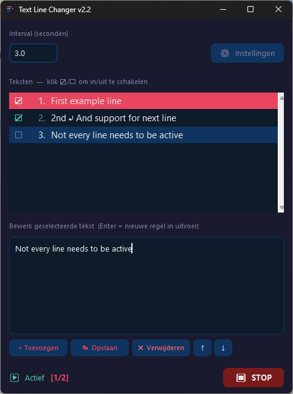

# Text Line Changer v2.3

Een tool om teksten met een instelbaar interval naar een tekstbestand te schrijven — handig als OBS-tekstbron voor streams.



## Vereisten
*   **Windows 10 of 11**
*   **Python 3.10 of nieuwer**: [Download hier](https://www.python.org/downloads/)
    *   *Let op: vink "Add Python to PATH" aan tijdens de installatie!*

## Direct Starten (zonder bouwen)
Dubbelklik op `text_line_changer.py` of gebruik de opdrachtprompt:
```bash
python text_line_changer.py
```

## EXE Bouwen
Dubbelklik op `build.bat`. Na het bouwen staat de EXE in de map `dist\TextLineChanger.exe`. Deze EXE kun je overal naartoe verplaatsen en gebruiken zonder dat Python geïnstalleerd hoeft te zijn.

## Gebruik
1.  **Uitvoerbestand**: Kies waar de tekst opgeslagen moet worden (bijv. `C:\OBS\tekst.txt`).
2.  **Teksten beheren**: Voeg teksten toe via de **+ Toevoegen** knop.
3.  **Bewerken**: Selecteer een item, pas de tekst aan en klik op **Opslaan**.
4.  **Inschakelen**: Gebruik de checkboxen (**☑/☐**) om te bepalen welke regels in de rotatie zitten.
5.  **Interval**: Stel de tijd in seconden in tussen de wisselingen.
6.  **Starten**: Druk op de **START** knop.

### Gebruik in OBS
Wijs in OBS een "Tekst (GDI+)"-bron aan op het gekozen uitvoerbestand. De tekst in OBS wordt nu automatisch bijgewerkt volgens jouw interval.

## Instellingen
Alle instellingen en teksten worden automatisch opgeslagen in:
`C:\Users\<gebruiker>\.text_line_changer.json`

## Licentie & Info
Gemaakt voor streamers die eenvoudige tekstrotatie nodig hebben zonder zware plugins.